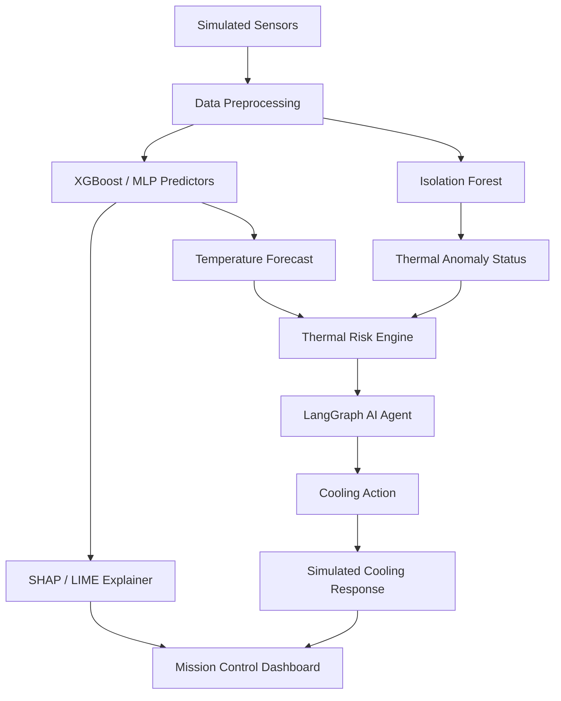

# ⚡ EV Battery Mission Control

> **Explainable AI-Based Battery Thermal Management & Digital Twin**

An Advanced Artificial Intelligence prototype for EV battery thermal monitoring, temperature prediction, thermal-risk assessment, and intelligent cooling decision support.

**⚠️ ACADEMIC / PROOF-OF-CONCEPT DISCLAIMER:**
This is a research/educational proof-of-concept system using synthetic/simulation-inspired data. It is NOT a certified battery safety system, NOT a production-ready BMS, and NOT an experimentally validated thermal runaway prediction tool.

## 🌟 1. Project Overview

The EV Battery Mission Control is a comprehensive Streamlit dashboard that acts as a virtual "Mission Control" center. It combines multiple AI/ML techniques to monitor and manage simulated battery thermal conditions, providing predictive safety and intelligent insights.

## 🎯 2. Problem Statement

Thermal runaway in Lithium-Ion batteries is a critical safety hazard for Electric Vehicles. Traditional Battery Management Systems (BMS) often rely on simple threshold-based rules. This project aims to demonstrate how an ensemble of Machine Learning models, Generative AI, and Agentic workflows can predict thermal risks *before* they occur, explain *why* the risk exists, and recommend optimal cooling strategies.

## ✨ 3. Key Features

- **Real-time Monitoring & Prediction**: Forecasts battery temperatures using Machine Learning.
- **Explainable AI (XAI)**: Understand model decisions locally and globally.
- **Generative AI for Telemetry**: Synthesizes edge-case data using cGAN and compresses signals via VAE.
- **RAG Knowledge Assistant**: Instant engineering answers grounded in BTMS literature.
- **Agentic Decision Support**: A deterministic workflow that evaluates risk and recommends action.
- **Responsible AI**: Strict separation between conversational LLMs and critical safety logic.

## 🏗️ 4. System Architecture



## 📊 5. Dataset

Since high-resolution, extreme-condition BTMS datasets are rare, this project uses a **Synthetic / Simulation-Inspired BTMS Dataset**.

- **Type**: Synthetic BTMS dataset
- **Size**: 10,000 rows
- **Columns**: 19 dataset columns
- **Input Features**: 14 model input features
- **Target**: `max_temp` (Maximum Battery Temperature)

## 🧠 6. Machine Learning Models

1. **XGBoost**: Primary regressor for fast, accurate temperature forecasting.
2. **PyTorch MLP**: Deep learning multi-layer perceptron for secondary temperature prediction.
3. **Isolation Forest**: Multivariate anomaly detection to flag unusual operating states.
4. **VAE (Variational Autoencoder)**: Compresses the 14D sensor signal into a 4D latent space for dimensionality reduction and reconstruction.
5. **cGAN (Conditional GAN)**: Synthesizes realistic battery telemetry conditioned on specific thermal risk profiles (Normal, Caution, High, Critical).

## 🔍 7. Explainable AI

- **SHAP (SHapley Additive exPlanations)**: Provides both global feature importance and local waterfall charts to explain individual predictions.
- **LIME (Local Interpretable Model-agnostic Explanations)**: Offers an alternative localized perturbation-based explanation for model transparency.

## 📚 8. RAG Assistant

An integrated Engineering Knowledge Assistant to query BTMS concepts.
- **Vector Store**: FAISS
- **Embeddings**: SentenceTransformers (`all-MiniLM-L6-v2`)
- **Knowledge Base**: Curated markdown documents containing BTMS fundamentals, cooling strategies, and safety definitions.
- **LLM Fallback**: If no LLM provider (OpenAI/Ollama) is available, the system gracefully falls back to displaying the raw retrieved context snippets safely without markdown artifacts.

## 🤖 9. AI Agent / LangGraph workflow

A structured, state-based workflow (LangGraph) handles safety decisions deterministically:
1. **Observe**: Ingest 14-feature sensor vector.
2. **Predict**: Execute XGBoost and MLP models.
3. **Evaluate Risk**: Determine thermal and hotspot risk.
4. **Simulate & Compare**: Simulate cooling interventions (e.g., 20%, 35%, Emergency) and compare predicted outcomes.
5. **Decide & Apply**: Select the optimal cooling strategy based on safety vs. energy cost.

## ⚖️ 10. Responsible AI

Safety is paramount. In this architecture:
- **LLM Independence**: The RAG Assistant LLM does **NOT** directly control battery safety decisions.
- **Deterministic Agent**: Safety decisions, risk evaluations, and cooling recommendations are generated by the deterministic LangGraph workflow and ML regression models.
- **Transparency**: All agent decisions provide transparent reasoning, separating safety logic from conversational AI.

## 🛠️ 11. Technology Stack

- **Frontend**: Streamlit, Plotly, HTML/CSS
- **Machine Learning**: Scikit-Learn, XGBoost, PyTorch
- **Agentic/RAG Framework**: LangGraph, LangChain, FAISS, SentenceTransformers
- **Explainability**: SHAP, LIME
- **Data Handling**: Pandas, NumPy

## 📁 12. Project Structure

- `app/`: Streamlit frontend pages (Mission Control, Digital Twin, VAE, etc.)
- `src/`: Core Python modules (preprocessing, models, agent graph, RAG pipeline)
- `data/`: Synthetic dataset and Markdown knowledge base.
- `models/`: Trained `.pt`, `.pkl`, and `.joblib` model artifacts.
- `config/`: Application configuration.

## 🚀 13. Installation

1. **Clone the repository:**
```bash
git clone <repository_url>
cd ev-battery-mission-control
```

2. **Create a virtual environment:**
```bash
python -m venv .venv
# Activate on Windows:
.venv\Scripts\activate
# Activate on Linux/Mac:
source .venv/bin/activate
```

3. **Install dependencies:**
```bash
pip install -r requirements.txt
```

4. **Environment Variables (Optional for RAG LLM):**
Copy `.env.example` to `.env` and add your OpenAI API key if you want conversational RAG.

## 🏃 14. How to Run

Launch the Mission Control dashboard:
```bash
streamlit run app/main.py
```

## 🧪 15. Example Workflow

1. Navigate to **Mission Control** to view the live dashboard.
2. Click **Start live simulation** to observe dynamic sensor changes and ML predictions.
3. Click **Simulate thermal stress** to watch the LangGraph agent intervene during a simulated runaway event.
4. Open the **XAI** page to see exactly why the temperature was predicted.
5. Visit the **RAG Assistant** to query the system about "Thermal Runaway causes".

## 🚧 16. Limitations

- The dataset is purely synthetic and does not fully capture complex real-world electro-thermal dynamics.
- Cooling simulation calculations (What-If and Agent simulations) are rule-based approximations for demonstration purposes.
- VAE and cGAN architectures are simplified for CPU inference.

## 🔮 17. Future Scope

- Integration with real BMS CAN-bus telemetry.
- Expanding the Digital Twin with real-time 3D CFD (Computational Fluid Dynamics) approximations.
- Implementing Reinforcement Learning for dynamic cooling optimization.

## ⚖️ 18. Disclaimer

This software is provided "as is", without warranty of any kind. It is an educational prototype and must never be deployed to manage real-world physical systems, batteries, or vehicles.
